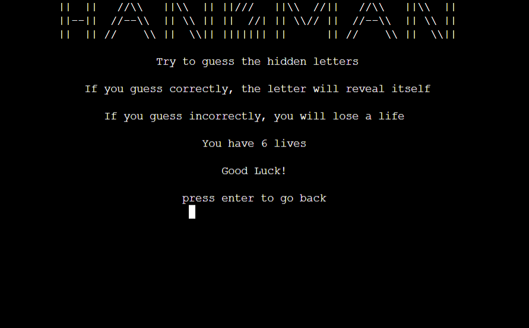
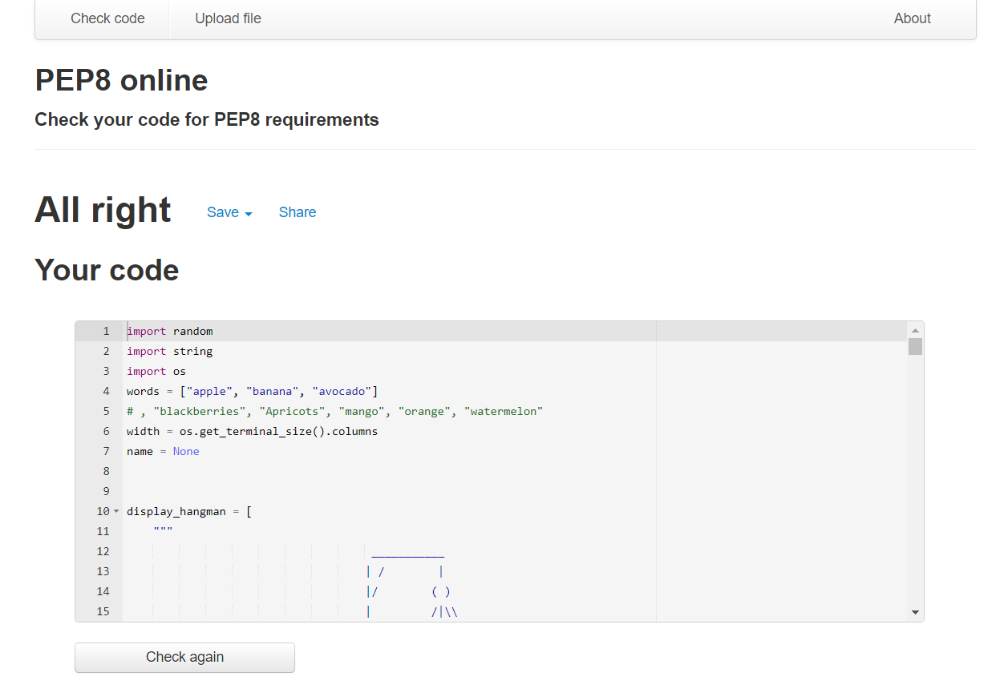

# Hangman Game
## 1. Purpose of the project
Hangman is a Python terminal game, wich runs in the Code Institute mock terminal on Heroku.

Users guess the right word by entering the right letters. They only have six lives, so if they guess six times wrong, they are executed! 

for the live site click
[here](https://hangman-game-ms.herokuapp.com/)

## 2. How to play
 The user can play this game by entering commands into the terminal. They must guess the letters correctly and have six guesses. The word will appear as "----", but if the user guesses the right letter, then the letter will appear instead of "-.". When the user enters a letter they have already guessed before, or puts a character that is invalid, they get a warning and must guess again. The user must guess all the letters in the word to win.

 ## 3. features
 ### existing features
 - Name input screen 
   - the user must input his name
 
 
 - Welcome screen
   - The user can choose either "P" for "Play game" or "H" for "How to play" here.

- How to play
  - In this section, the user can see how the game is played and can press enter to return to the previous page

- The game
  - The computer selects a random word
  - A letter must be guessed by the user
  - If the user guesses correctly, the letter will be displayed
  - They will lose a life if they guess the wrong letter, and   the hangman will start to appear
  
  - The user can see how many lives they have left and what letters they have already used
  - After guessing the word, the user can move on to the next word
  -  The user can choose to play again if they die

### future features
- set difficulty levels
- add highscores 

## 4. Technology
These are the Technology I used for this project.
- Python
- Git
- Gitpod
- Github
- Heroku
- Tinypng

## 5. Lucid

## 6. Testing
I have tested this project by doing the following:

- Passed the code through a PEP8 linter and confirmed there are no problems.

- Given invalid inputs: strings when numbers are excepted, out of bounds inputs, same input twice.
- Tested in my local terminal and the Code Institute Heroku terminal.
- Name validation. The user must enter letters, numbers or other inputs are not allowed.

- Press enter validation. The user must press enter.

- letter input validation. Only one letter can be entered by the user.

- Letter is in the word

- Letter is not in the word

- Win

- Died

- Continue validation. If the user wants to continue or quit, they must choose Y or N

## 7. Bugs
### Solved bugs
Some print lines were too long, so I split them into two

### Remaining bugs
The game is not working on iphone, and the Code Institute tutor told me this :

Im looking into it, yes on iphone it is not working but in the browser the deployed version will work.

So it appears that it is not designed to be run on a mobile at all, it is not responsive and therefore I don't believe that testing on a mobile will go ahead.

This is nothing you have done, it is the library used to create the console "emulator", its just not compatible.

I would document this in your readme if you like, but the outcome is that all projects using this template, which is a requirement of pp3 will have the same issue.
## 8. Deployment
This game was deployed to GitHub pages :

### Gitpod

1. In gitpod workspaces
2. I choose the right workspace/repo
3. Now i can write my code and readme
4. To save my code I Type in the terminal : git add .
5. I type git commit -m "comment"
6. I type git push to push it to github

### Heroku

1. Fork or clone this repository.
2. requirements.txt can be left empty as this project does not use any external libraries.
3. Create a new app in Heroku.
4. Select "New" and "Create new app".
5. Name the new app and click "Create new app".
6. In "Settings" select "BuildPack" and select Python and Node.js.
7. Whilst still in "Settings", click "Reveal Config Vars" and input the folloing. KEY: PORT, VALUE: 8000. Nothing else is needed here as this project does not have any sensitive files.
8. Click on "Deploy" and select your deploy method and repository.
9. Click "Connect" on selected repository.
10. choose "Deploy Branch" in the manual deploy section.
11. you can choose "Enable Automatic Deploys" if you want.
10. Heroku will now deploy the site.

## 9. Credits
- My mentor Rohit Sharma
- Stackoverflow
- youtube tutorials